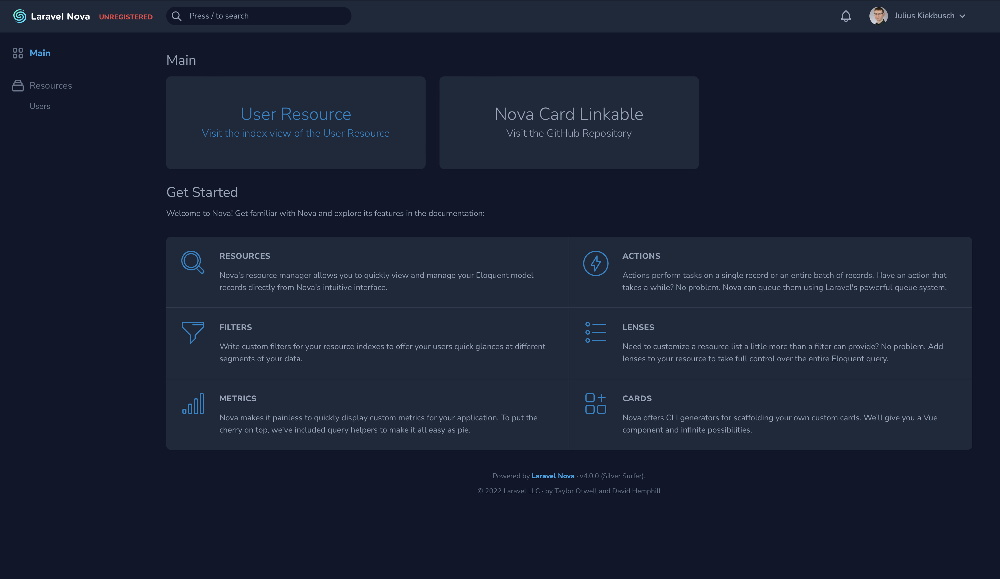

# Linkable Cards for Laravel Nova

> ⚠️ These docs are for the latest version. If you are using an older version you can find the docs for previous releases [here](https://github.com/Jubeki/Nova-Card-Linkable/tree/1.x#readme). To upgrade from `1.x` to `2.x` please take a look at the [Upgrade Guide](UPGRADE.md)

## Add Cards to Laravel Nova which link to another page

[](https://packagist.org/packages/jubeki/nova-card-linkable)
[](https://packagist.org/packages/jubeki/nova-card-linkable)

* [Requirements](#requirements)
* [Installation](#installation)
* [Upgrading from 1.x to 2.x](#upgrading-from-1.x-to-2.x)
* [Cards](#cards)
    * [Linkable](#linkable)
    * [Linkable Away](#linkable-away)

## Requirements

* [Laravel v8.x](https://laravel.com/docs/8.x) or [v9.x](https://laravel.com/docs/9.x)
* [Laravel Nova v4.x](https://nova.laravel.com/docs/4.0/)

## Installation

Just run:  
```
composer require jubeki/nova-card-linkable
```
After this the setup will be complete and you can use the components listed here.

To publish the config you can simply run:
```
php artisan vendor:publish --provider="Jubeki\Nova\Cards\Linkable\CardServiceProvider"
```

## Upgrading from 1.x to 2.x

To upgrade from `1.x` to `2.x` please take a look at the [Upgrade Guide](UPGRADE.md)

## Cards

What is the difference between the card types?
* **Linkable:** Links to a page in your application and makes use of inertia links
* **Linkable Away:** Links to a page which is outside of your application

The Design is the same for all of them and most of the options are also the same, so they will be listed here. (The left linkable card has a hover effect applied)



## Usage

```php
// in app/Nova/Dashboards/Main.php

namespace App\Nova\Dashboards;

use Jubeki\Nova\Cards\Linkable\Linkable;
use Jubeki\Nova\Cards\Linkable\LinkableAway;
use Laravel\Nova\Cards\Help;
use Laravel\Nova\Dashboards\Main as Dashboard;

class Main extends Dashboard
{
    /**
     * Get the cards for the dashboard.
     *
     * @return array
     */
    public function cards()
    {
        return [
            (new Linkable)
            ->title('User Resource')
            ->url('/nova/resources/users')
            ->subtitle('Visit the index view of the User Resource'),

            (new LinkableAway)
            ->title('Nova Card Linkable')
            ->url('https://github.com/Jubeki/Nova-Card-Linkable/')
            ->subtitle('Visit the GitHub Repository'),

            new Help,
        ];
    }
}
```

### Options

All options are chainable.

#### Setting the subtitle of the Card

```php
$linkable->title('Title of Card');
```

#### Setting the subtitle of the Card

```php
$linkable->subtitle('Subtitle of Card');
```

#### Setting the url of the Card

```php
$linkable->url('https://github.com/Jubeki/Nova-Card-Linkable');
```

#### Setting the theme of the Card

```php
$linkable->theme([
    'layout' => 'p-3 flex flex-col items-center justify-center h-full',
    'colors' => 'text-90 hover:text-primary-600',
    'title' => 'text-3xl font-light text-center',
    'subtitle' => 'text-lg font-light text-center',
]);
```

#### Setting the target
only available for `Jubeki\Nova\Cards\Linkable\LinkableAway`
```php
$linkable->target('_blank');
```
